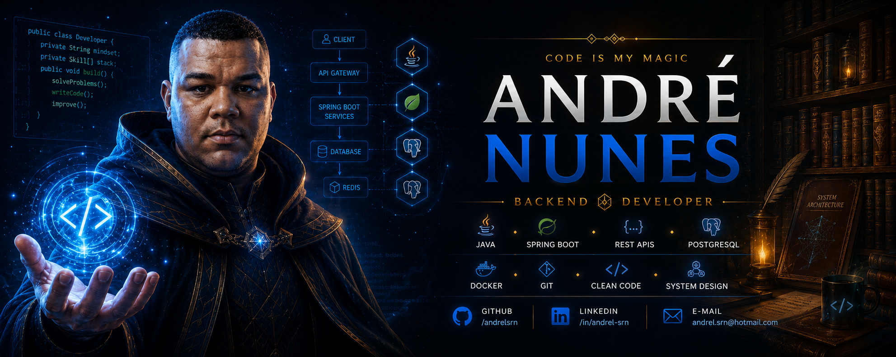
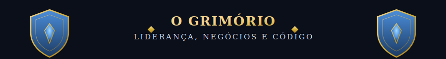
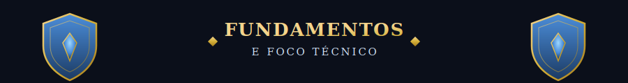
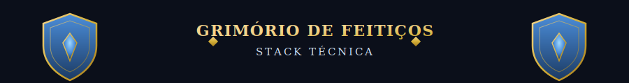
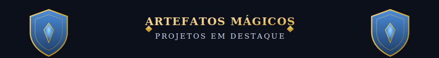
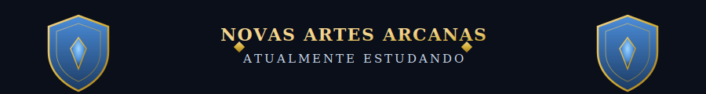
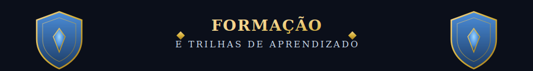
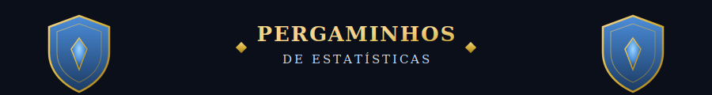
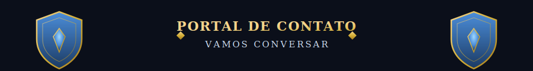

 

 

---

 

> *"Todo bom backend developer é, no fundo, um mago disfarçado de engenheiro.
> Trocamos varinhas por teclados, feitiços por endpoints —
> a magia acontece nos bastidores, onde ninguém vê, mas todos sentem o efeito."*

Minha jornada não começou no código — começou nos negócios. Foram **7 anos de empreendedorismo nos Estados Unidos**, fundando e gerindo empresas do zero. Hoje, estou canalizando essa experiência para o **Desenvolvimento Backend**, e ela me dá uma perspectiva que poucos magos de código carregam:

- 🎯 **Ownership e Proatividade** — visão 360º de produto; assumo a responsabilidade pelo ciclo de vida completo das soluções, da concepção à manutenção.
- 🧩 **Resolução de Problemas** — anos buscando soluções rápidas e eficazes sob pressão real, habilidade que aplico direto na depuração e otimização de sistemas.
- 🗣️ **Comunicação Estratégica** — traduzir requisitos técnicos em escopo de projeto, com foco em prazos e resultado de negócio.

---

 

Estou cursando **Engenharia de Software** e construindo projetos práticos com foco em escalabilidade e performance:

- 🔥 **Linguagens Backend** — versatilidade em **Java (Spring Boot)**, **Python (FastAPI)** e **JavaScript (Node.js)** para construir APIs robustas em diferentes ambientes.
- 🔮 **Sistemas de Dados** — persistência SQL (**PostgreSQL**) e NoSQL (**MongoDB**), com domínio para modelar diferentes arquiteturas.
- 📖 **Arquitetura** — Design Patterns, princípios **SOLID**, código limpo e sistemas distribuídos.
- 🧪 **Infraestrutura/Cloud** — **Docker** e serviços **AWS (S3)**, garantindo prontidão para produção.
- 🪄 Foco em **Backend**, mas também domino feitiços de **Front-end** (HTML/CSS, JavaScript, React, TypeScript) quando a missão exige.

---

 

<table align="center">
<tr>
<th>Escola de Magia</th>
<th>Feitiços Dominados</th>
</tr>
<tr>
<td align="center">🔥 <b>Magia Elemental</b> (Linguagens)</td>
<td align="center">

</td>
</tr>
<tr>
<td align="center">🌿 <b>Encantamentos</b> de Backend</td>
<td align="center">

</td>
</tr>
<tr>
<td align="center">🎨 <b>Magia Visual</b> (Front-end)</td>
<td align="center">

</td>
</tr>
<tr>
<td align="center">🔮 <b>Invocação</b> de Dados</td>
<td align="center">

</td>
</tr>
<tr>
<td align="center">🧪 <b>Alquimia</b> de Infraestrutura</td>
<td align="center">

</td>
</tr>
<tr>
<td align="center">📖 <b>Runas Antigas</b></td>
<td align="center">Clean Code · Design Patterns · SOLID · System Design</td>
</tr>
</table>

---

 

<!-- Quando tiver o arquivo coruja.png no repo, remova o comentário abaixo -->
<!--  -->

### 📌 Sistema de Orçamento para Cercas
API REST desenvolvida para gerenciamento de orçamentos, com autenticação e controle de acesso.

`Spring Boot` · `PostgreSQL` · `Spring Security` · `JWT Authentication`

- Controle de acesso por perfis (**ADMIN** e **USER**)
- Arquitetura em camadas
- DTOs e boas práticas REST

### 📌 Accident Alert API
Sistema backend para registro e monitoramento de acidentes.

`Java` · `Spring Boot` · `PostgreSQL` · `Docker`

- Documentação de APIs
- Estrutura pronta para escalar

---

 

     

- Microsserviços · Spring Cloud · RabbitMQ · Apache Kafka
- Testes Automatizados · CI/CD
- Arquitetura de Software · Design Patterns · SOLID

---

 

- 🏛️ **Engenharia de Software**
- ⚙️ Bootcamp Java — **Cummins + Generation Brasil**
- ⚙️ Bootcamp Java — **Matera**
- ⚙️ Formação Backend Java
- 📖 Estudos contínuos em **Spring Boot** e **Arquitetura de Software**

---

 

---

 

<!-- Quando tiver o arquivo coruja_pequena.png no repo, remova o comentário abaixo -->
<!--  -->

✨ "Todo código bem escrito é, no fim das contas, um feitiço que funciona." ✨

